# Nodes Reference

This document provides a complete reference for all node types available in pom.

## Common Properties

Layout attributes that all nodes can have.

```typescript
{
  w?: number | "max" | `${number}%`;
  h?: number | "max" | `${number}%`;
  minW?: number;
  maxW?: number;
  minH?: number;
  maxH?: number;
  padding?: number;
  backgroundColor?: string;
  border?: {
    color?: string;
    width?: number;
    dashType?: "solid" | "dash" | "dashDot" | "lgDash" | "lgDashDot" | "lgDashDotDot" | "sysDash" | "sysDot";
  };
  borderRadius?: number;
}
```

- `backgroundColor` applies a fill to the entire node (e.g., `"F8F9FA"`).
- `border.width` is specified in px and can be combined with color and `dashType` to control the border.
- `borderRadius` specifies the corner radius in px. When specified, the background/border shape becomes a rounded rectangle.

## Node List

### 1. Text

A node for displaying text.


```typescript
{
  type: "text";
  text: string;
  fontPx?: number;
  color?: string;
  alignText?: "left" | "center" | "right";
  bold?: boolean;
  fontFamily?: string;
  lineSpacingMultiple?: number;
  bullet?: boolean | BulletOptions;

  // Common properties
  w?: number | "max" | `${number}%`;
  h?: number | "max" | `${number}%`;
  ...
}
```

- `color` specifies the text color as a hex color code (e.g., `"FF0000"`).
- `bold` enables bold text.
- `fontFamily` specifies the font family (default: `"Noto Sans JP"`).
- `lineSpacingMultiple` specifies the line spacing multiplier (default: `1.3`).
- `bullet` enables bullet points. Use `true` for default bullets, or an object for detailed settings.

**BulletOptions:**

```typescript
{
  type?: "bullet" | "number";  // "bullet": symbol, "number": numbered
  indent?: number;             // Indent level
  numberType?: "alphaLcParenBoth" | "alphaLcParenR" | "alphaLcPeriod" |
               "alphaUcParenBoth" | "alphaUcParenR" | "alphaUcPeriod" |
               "arabicParenBoth" | "arabicParenR" | "arabicPeriod" | "arabicPlain" |
               "romanLcParenBoth" | "romanLcParenR" | "romanLcPeriod" |
               "romanUcParenBoth" | "romanUcParenR" | "romanUcPeriod";
  numberStartAt?: number;      // Starting number
}
```

**Usage Examples:**

```typescript
// Simple bullet list
{
  type: "text",
  text: "Item 1\nItem 2\nItem 3",
  bullet: true,
}

// Numbered list
{
  type: "text",
  text: "Step 1\nStep 2\nStep 3",
  bullet: { type: "number" },
}

// Lowercase alphabet (a. b. c.)
{
  type: "text",
  text: "Item A\nItem B\nItem C",
  bullet: { type: "number", numberType: "alphaLcPeriod" },
}

// Numbered list starting from 5
{
  type: "text",
  text: "Fifth\nSixth\nSeventh",
  bullet: { type: "number", numberStartAt: 5 },
}
```

### 2. Image

A node for displaying images.

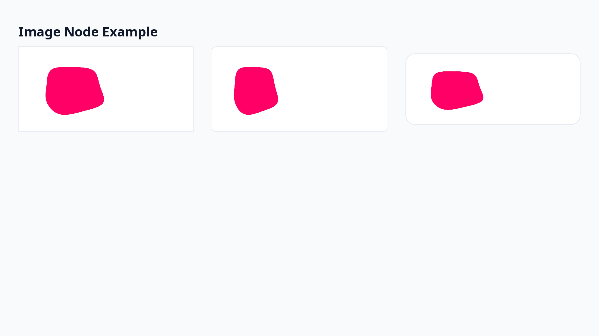

- If `w` and `h` are not specified, the actual image size is automatically used
- If size is specified, the image is displayed at that size (aspect ratio is not preserved)

```typescript
{
  type: "image";
  src: string;  // Image path (local path, URL, or base64 data)

  // Common properties
  w?: number | "max" | `${number}%`;
  h?: number | "max" | `${number}%`;
  ...
}
```

### 3. Table

A node for drawing tables. Column widths and row heights are declared in px, with fine-grained control over cell decoration.

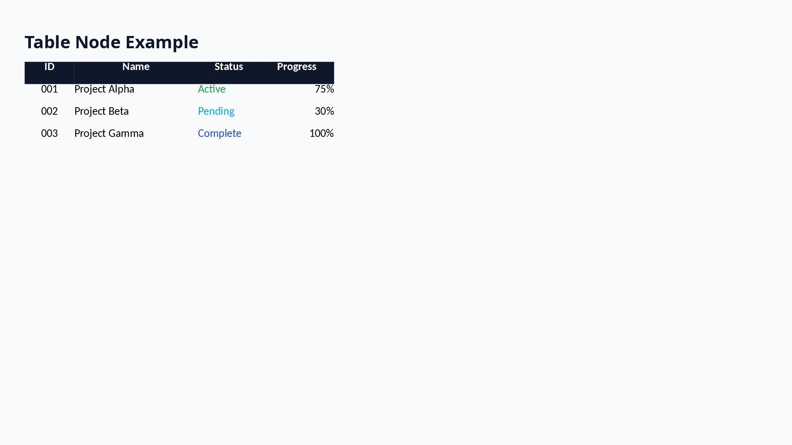

```typescript
{
  type: "table";
  columns: { width?: number }[];
  rows: {
    height?: number;
    cells: {
      text: string;
      fontPx?: number;
      color?: string;
      bold?: boolean;
      alignText?: "left" | "center" | "right";
      backgroundColor?: string;
    }[];
  }[];
  defaultRowHeight?: number;

  // Common properties
  w?: number | "max" | `${number}%`;
  h?: number | "max" | `${number}%`;
  ...
}
```

- If `columns[].width` is omitted, columns are evenly distributed across the table width.
- The sum of `columns` becomes the natural width of the table (can be overridden with `w` if needed).
- If `rows` `height` is omitted, `defaultRowHeight` is applied (32px if unspecified).
- Cell background and font decoration can be specified individually for each element in `cells`.

### 4. Shape

A node for drawing shapes. Different representations are possible with or without text, supporting complex visual effects.

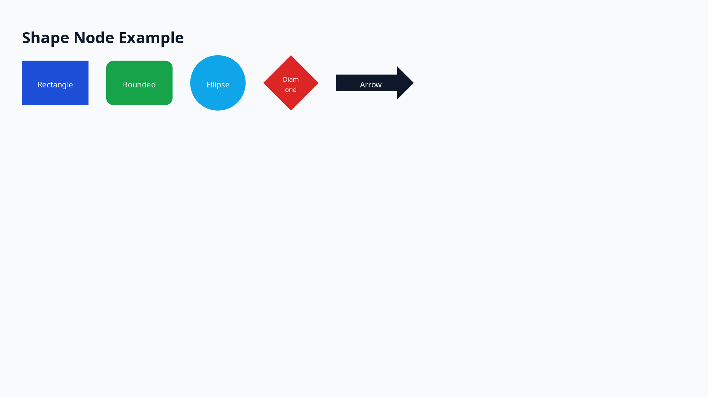

```typescript
{
  type: "shape";
  shapeType: PptxGenJS.SHAPE_NAME;  // e.g., "roundRect", "ellipse", "cloud", "star5"
  text?: string;                     // Text to display inside the shape (optional)
  fill?: {
    color?: string;
    transparency?: number;
  };
  line?: {
    color?: string;
    width?: number;
    dashType?: "solid" | "dash" | "dashDot" | "lgDash" | "lgDashDot" | "lgDashDotDot" | "sysDash" | "sysDot";
  };
  shadow?: {
    type: "outer" | "inner";
    opacity?: number;
    blur?: number;
    angle?: number;
    offset?: number;
    color?: string;
  };
  fontPx?: number;
  color?: string;
  alignText?: "left" | "center" | "right";

  // Common properties
  w?: number | "max" | `${number}%`;
  h?: number | "max" | `${number}%`;
  ...
}
```

**Common Shape Types:**

- `roundRect`: Rounded rectangle (title boxes, category displays)
- `ellipse`: Ellipse/circle (step numbers, badges)
- `cloud`: Cloud shape (comments, key points)
- `wedgeRectCallout`: Callout with arrow (annotations)
- `cloudCallout`: Cloud callout (comments)
- `star5`: 5-pointed star (emphasis, decoration)
- `downArrow`: Down arrow (flow diagrams)

### 5. Box

A generic container that wraps a single child element.

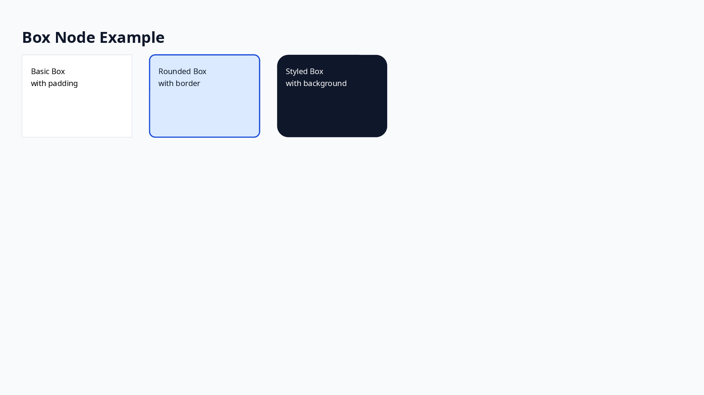

- Only **one** child element
- Used for grouping with padding or fixed size

```typescript
{
  type: "box";
  children: POMNode;

  // Common properties
  w?: number | "max" | `${number}%`;
  h?: number | "max" | `${number}%`;
  ...
}
```

### 6. VStack

Arranges child elements **vertically**.

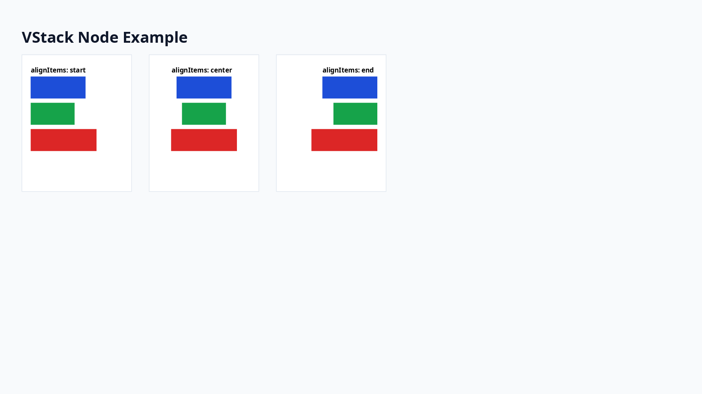

```typescript
{
  type: "vstack";
  children: POMNode[];
  alignItems: "start" | "center" | "end" | "stretch";
  justifyContent: "start" | "center" | "end" | "spaceBetween";
  gap?: number;

  // Common properties
  w?: number | "max" | `${number}%`;
  h?: number | "max" | `${number}%`;
  ...
}
```

### 7. HStack

Arranges child elements **horizontally**.

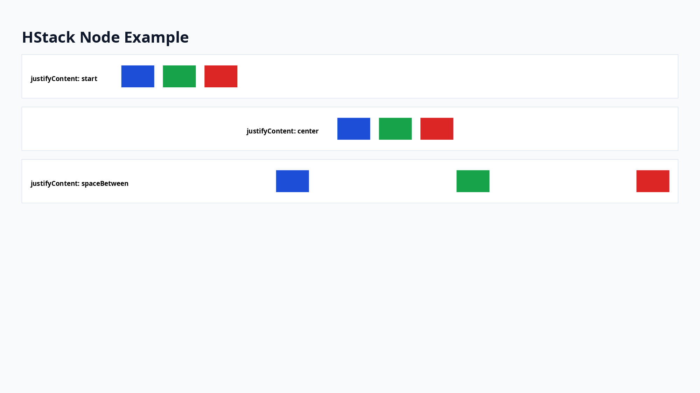

```typescript
{
  type: "hstack";
  children: POMNode[];
  alignItems: "start" | "center" | "end" | "stretch";
  justifyContent: "start" | "center" | "end" | "spaceBetween";
  gap?: number;

  // Common properties
  w?: number | "max" | `${number}%`;
  h?: number | "max" | `${number}%`;
  ...
}
```

### 8. Chart

A node for drawing charts. Supports bar charts, line charts, pie charts, area charts, doughnut charts, and radar charts.

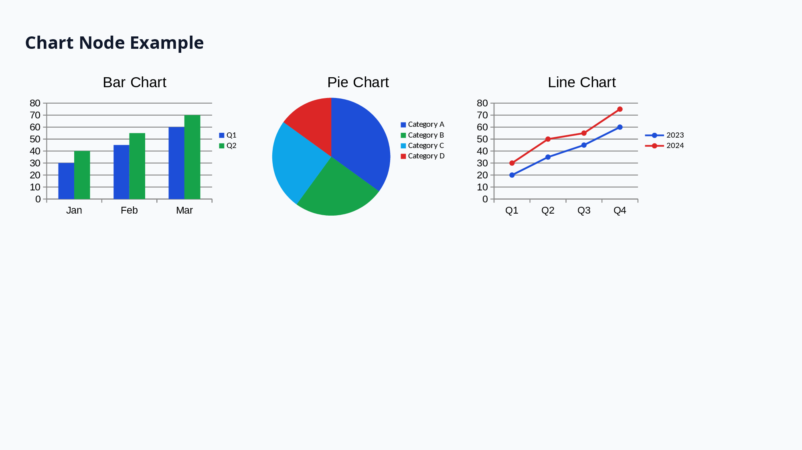

```typescript
{
  type: "chart";
  chartType: "bar" | "line" | "pie" | "area" | "doughnut" | "radar";
  data: {
    name?: string;           // Series name
    labels: string[];        // Category labels
    values: number[];        // Values
  }[];
  showLegend?: boolean;      // Show legend (default: false)
  showTitle?: boolean;       // Show title (default: false)
  title?: string;            // Title string
  chartColors?: string[];    // Data color array (hex color codes)
  radarStyle?: "standard" | "marker" | "filled";  // Radar-only: chart style

  // Common properties
  w?: number | "max" | `${number}%`;
  h?: number | "max" | `${number}%`;
  ...
}
```

**Usage Examples:**

```typescript
// Bar chart
{
  type: "chart",
  chartType: "bar",
  w: 600,
  h: 400,
  data: [
    {
      name: "Sales",
      labels: ["Jan", "Feb", "Mar", "Apr"],
      values: [100, 200, 150, 300],
    },
    {
      name: "Profit",
      labels: ["Jan", "Feb", "Mar", "Apr"],
      values: [30, 60, 45, 90],
    },
  ],
  showLegend: true,
  showTitle: true,
  title: "Monthly Sales & Profit",
  chartColors: ["0088CC", "00AA00"],
}

// Pie chart
{
  type: "chart",
  chartType: "pie",
  w: 400,
  h: 300,
  data: [
    {
      name: "Market Share",
      labels: ["Product A", "Product B", "Product C", "Others"],
      values: [40, 30, 20, 10],
    },
  ],
  showLegend: true,
  chartColors: ["0088CC", "00AA00", "FF6600", "888888"],
}

// Radar chart
{
  type: "chart",
  chartType: "radar",
  w: 400,
  h: 300,
  data: [
    {
      name: "Skill Assessment",
      labels: ["Technical", "Design", "PM", "Sales", "Support"],
      values: [80, 60, 70, 50, 90],
    },
  ],
  showLegend: true,
  radarStyle: "filled",
  chartColors: ["0088CC"],
}
```

### 9. Timeline

A node for creating timeline/roadmap visualizations. Supports horizontal and vertical layouts.

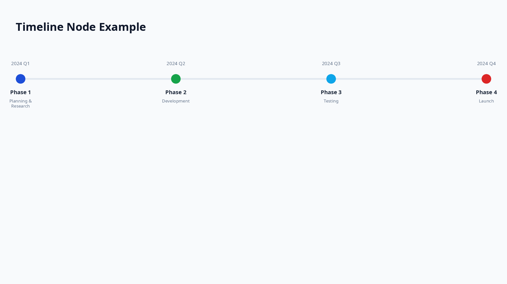

```typescript
{
  type: "timeline";
  direction?: "horizontal" | "vertical";  // Default: "horizontal"
  items: {
    date: string;           // Date/period label
    title: string;          // Item title
    description?: string;   // Optional description
    color?: string;         // Node color (hex, default: "1D4ED8")
  }[];

  // Common properties
  w?: number | "max" | `${number}%`;
  h?: number | "max" | `${number}%`;
  ...
}
```

**Usage Examples:**

```typescript
// Horizontal roadmap
{
  type: "timeline",
  direction: "horizontal",
  w: 1000,
  h: 120,
  items: [
    { date: "2025/Q1", title: "Phase 1", description: "Foundation", color: "4CAF50" },
    { date: "2025/Q2", title: "Phase 2", description: "Development", color: "2196F3" },
    { date: "2025/Q3", title: "Phase 3", description: "Testing", color: "FF9800" },
    { date: "2025/Q4", title: "Phase 4", description: "Release", color: "E91E63" },
  ],
}

// Vertical project plan
{
  type: "timeline",
  direction: "vertical",
  w: 400,
  h: 300,
  items: [
    { date: "Week 1", title: "Planning" },
    { date: "Week 2-3", title: "Development" },
    { date: "Week 4", title: "Release" },
  ],
}
```

### 10. Matrix

A node for creating 2x2 matrix/positioning maps. Commonly used for cost-effectiveness analysis, impact-effort prioritization, etc.

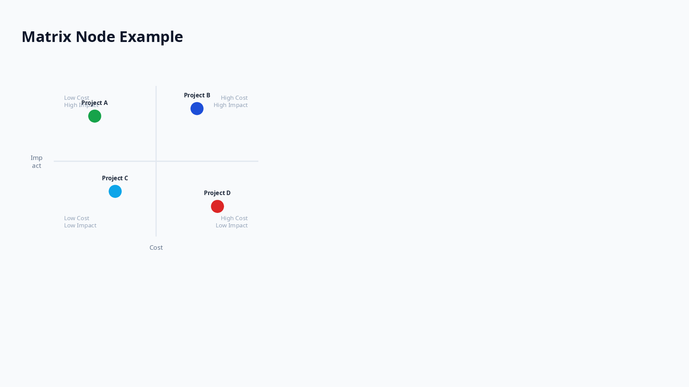

```typescript
{
  type: "matrix";
  axes: {
    x: string;  // X-axis label (e.g., "Cost")
    y: string;  // Y-axis label (e.g., "Effect")
  };
  quadrants?: {
    topLeft: string;     // Top-left quadrant label
    topRight: string;    // Top-right quadrant label
    bottomLeft: string;  // Bottom-left quadrant label
    bottomRight: string; // Bottom-right quadrant label
  };
  items: {
    label: string;       // Item label
    x: number;           // X coordinate (0-1, relative)
    y: number;           // Y coordinate (0-1, relative)
    color?: string;      // Item color (hex, default: "1D4ED8")
  }[];

  // Common properties
  w?: number | "max" | `${number}%`;
  h?: number | "max" | `${number}%`;
  ...
}
```

**Note:** The coordinate system uses (0, 0) as bottom-left and (1, 1) as top-right (mathematical coordinate system).

**Usage Examples:**

```typescript
// Cost-Effectiveness Matrix
{
  type: "matrix",
  w: 600,
  h: 500,
  axes: { x: "Cost", y: "Effect" },
  quadrants: {
    topLeft: "Low Cost / High Effect\n(Priority)",
    topRight: "High Cost / High Effect\n(Consider)",
    bottomLeft: "Low Cost / Low Effect\n(Low Priority)",
    bottomRight: "High Cost / Low Effect\n(Avoid)",
  },
  items: [
    { label: "Initiative A", x: 0.2, y: 0.8, color: "4CAF50" },
    { label: "Initiative B", x: 0.7, y: 0.6, color: "2196F3" },
    { label: "Initiative C", x: 0.3, y: 0.3, color: "FF9800" },
    { label: "Initiative D", x: 0.8, y: 0.2, color: "E91E63" },
  ],
}

// Simple Impact-Effort Matrix (without quadrant labels)
{
  type: "matrix",
  w: 500,
  h: 400,
  axes: { x: "Effort", y: "Impact" },
  items: [
    { label: "Quick Win", x: 0.15, y: 0.85 },
    { label: "Major Project", x: 0.75, y: 0.75 },
    { label: "Fill-In", x: 0.25, y: 0.25 },
    { label: "Time Sink", x: 0.85, y: 0.15 },
  ],
}
```

### 11. Tree

A node for creating tree structures such as organization charts, decision trees, and hierarchical diagrams.

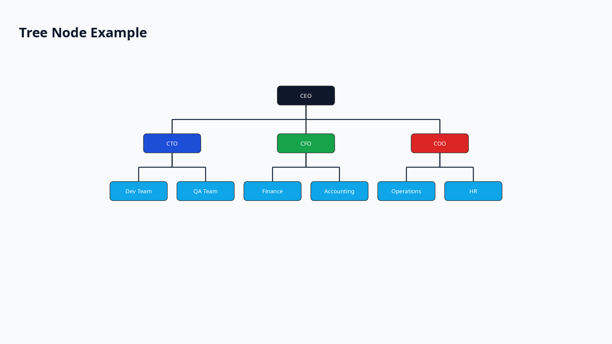

```typescript
{
  type: "tree";
  layout?: "vertical" | "horizontal";  // Tree direction (default: "vertical")
  nodeShape?: "rect" | "roundRect" | "ellipse";  // Node shape (default: "rect")
  data: {
    label: string;       // Node label
    color?: string;      // Node color (hex, default: "1D4ED8")
    children?: TreeDataItem[];  // Child nodes
  };
  connectorStyle?: {
    color?: string;      // Connector line color (default: "333333")
    width?: number;      // Connector line width (default: 2)
  };
  nodeWidth?: number;    // Node width in px (default: 120)
  nodeHeight?: number;   // Node height in px (default: 40)
  levelGap?: number;     // Gap between levels in px (default: 60)
  siblingGap?: number;   // Gap between siblings in px (default: 20)

  // Common properties
  w?: number | "max" | `${number}%`;
  h?: number | "max" | `${number}%`;
  ...
}
```

**Usage Examples:**

```typescript
// Vertical Organization Chart
{
  type: "tree",
  layout: "vertical",
  nodeShape: "roundRect",
  w: 600,
  h: 400,
  data: {
    label: "CEO",
    color: "1D4ED8",
    children: [
      {
        label: "CTO",
        color: "0EA5E9",
        children: [
          { label: "Engineer A" },
          { label: "Engineer B" },
        ],
      },
      {
        label: "CFO",
        color: "16A34A",
        children: [
          { label: "Accountant" },
        ],
      },
    ],
  },
  connectorStyle: { color: "333333", width: 2 },
}

// Horizontal Decision Tree
{
  type: "tree",
  layout: "horizontal",
  nodeShape: "rect",
  w: 600,
  h: 300,
  data: {
    label: "Start",
    children: [
      {
        label: "Option A",
        children: [
          { label: "Result 1" },
          { label: "Result 2" },
        ],
      },
      {
        label: "Option B",
        children: [
          { label: "Result 3" },
        ],
      },
    ],
  },
}
```

### 12. Flow

A node for creating flowcharts. Supports various node shapes and automatic layout.

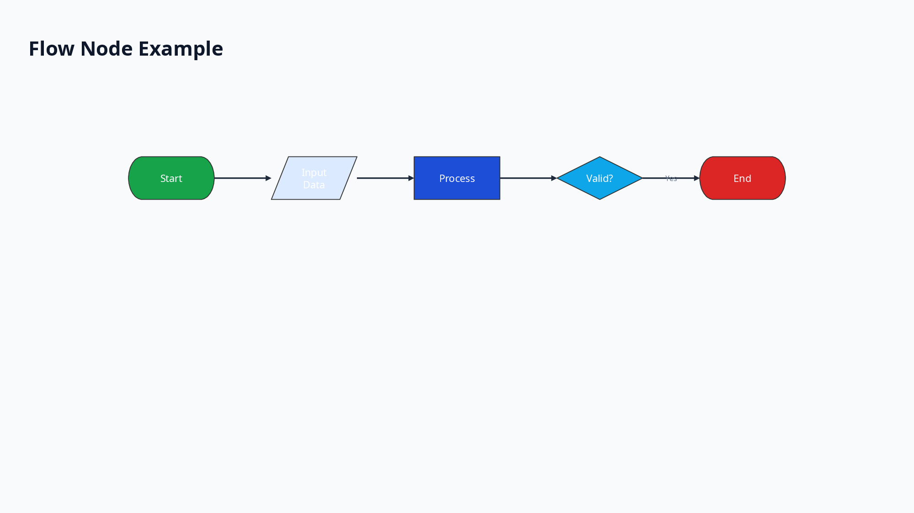

```typescript
{
  type: "flow";
  direction?: "TB" | "LR";  // TB: top-to-bottom, LR: left-to-right (default: "TB")
  nodes: {
    id: string;           // Unique node identifier
    label: string;        // Node label
    shape?: "rect" | "roundRect" | "diamond" | "ellipse" | "parallelogram";  // Node shape (default: "rect")
    color?: string;       // Node color (hex, default: "1D4ED8")
  }[];
  edges: {
    from: string;         // Source node ID
    to: string;           // Target node ID
    label?: string;       // Edge label
  }[];
  nodeWidth?: number;     // Node width in px (default: 120)
  nodeHeight?: number;    // Node height in px (default: 40)
  nodeGap?: number;       // Gap between nodes in px (default: 60)
  rankGap?: number;       // Gap between ranks in px (default: 80)

  // Common properties
  w?: number | "max" | `${number}%`;
  h?: number | "max" | `${number}%`;
  ...
}
```

**Usage Examples:**

```typescript
// Simple vertical flowchart
{
  type: "flow",
  direction: "TB",
  w: 400,
  h: 300,
  nodes: [
    { id: "start", label: "Start", shape: "ellipse", color: "4CAF50" },
    { id: "process", label: "Process", shape: "rect" },
    { id: "decision", label: "OK?", shape: "diamond", color: "FF9800" },
    { id: "end", label: "End", shape: "ellipse", color: "E91E63" },
  ],
  edges: [
    { from: "start", to: "process" },
    { from: "process", to: "decision" },
    { from: "decision", to: "end", label: "Yes" },
  ],
}

// Horizontal flowchart
{
  type: "flow",
  direction: "LR",
  w: 600,
  h: 200,
  nodes: [
    { id: "input", label: "Input", shape: "parallelogram" },
    { id: "validate", label: "Validate" },
    { id: "save", label: "Save" },
    { id: "output", label: "Output", shape: "parallelogram" },
  ],
  edges: [
    { from: "input", to: "validate" },
    { from: "validate", to: "save" },
    { from: "save", to: "output" },
  ],
}
```

### 13. ProcessArrow

A node for creating chevron-style process diagrams. Commonly used for visualizing sequential steps in a workflow.

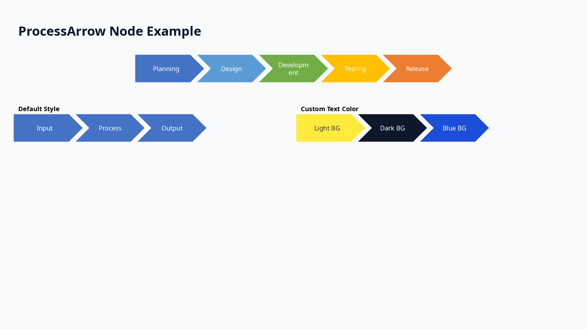

```typescript
{
  type: "processArrow";
  direction?: "horizontal" | "vertical";  // Default: "horizontal"
  steps: {
    label: string;       // Step label
    color?: string;      // Step color (hex, default: "4472C4")
    textColor?: string;  // Text color (hex, default: "FFFFFF")
  }[];
  itemWidth?: number;    // Step width in px (default: 150)
  itemHeight?: number;   // Step height in px (default: 60)
  gap?: number;          // Gap between steps in px (default: -15, negative for overlap)
  fontPx?: number;       // Font size (default: 14)
  bold?: boolean;        // Bold text (default: false)

  // Common properties
  w?: number | "max" | `${number}%`;
  h?: number | "max" | `${number}%`;
  ...
}
```

**Usage Examples:**

```typescript
// Horizontal process arrow with colors
{
  type: "processArrow",
  direction: "horizontal",
  w: 1000,
  h: 80,
  steps: [
    { label: "Planning", color: "#4472C4" },
    { label: "Design", color: "#5B9BD5" },
    { label: "Development", color: "#70AD47" },
    { label: "Testing", color: "#FFC000" },
    { label: "Release", color: "#ED7D31" },
  ],
}

// Vertical process arrow
{
  type: "processArrow",
  direction: "vertical",
  w: 200,
  h: 250,
  steps: [
    { label: "Phase 1", color: "#4CAF50" },
    { label: "Phase 2", color: "#2196F3" },
    { label: "Phase 3", color: "#9C27B0" },
  ],
}

// Custom styling
{
  type: "processArrow",
  direction: "horizontal",
  w: 600,
  h: 80,
  itemWidth: 180,
  itemHeight: 70,
  fontPx: 16,
  bold: true,
  steps: [
    { label: "Input", color: "#2196F3" },
    { label: "Process", color: "#00BCD4" },
    { label: "Output", color: "#009688" },
  ],
}
```

### 14. Line

A node for drawing lines and arrows. Uses absolute coordinates (x1, y1, x2, y2) for start and end points.

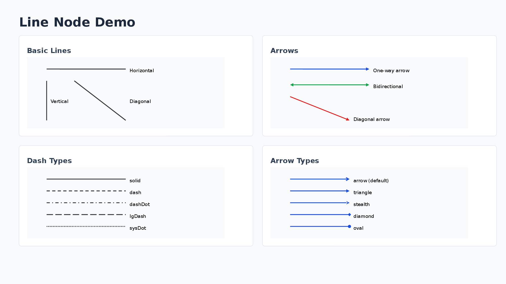

```typescript
{
  type: "line";
  x1: number;      // Start point X (px)
  y1: number;      // Start point Y (px)
  x2: number;      // End point X (px)
  y2: number;      // End point Y (px)
  color?: string;  // Line color (hex, default: "000000")
  lineWidth?: number;  // Line width (px, default: 1)
  dashType?: "solid" | "dash" | "dashDot" | "lgDash" | "lgDashDot" | "lgDashDotDot" | "sysDash" | "sysDot";
  beginArrow?: boolean | ArrowOptions;  // Arrow at start point
  endArrow?: boolean | ArrowOptions;    // Arrow at end point

  // Common properties (optional, not typically used with line)
  w?: number | "max" | `${number}%`;
  h?: number | "max" | `${number}%`;
  ...
}
```

**ArrowOptions:**

```typescript
{
  type?: "none" | "arrow" | "triangle" | "diamond" | "oval" | "stealth";
}
```

**Note:** Line nodes use absolute coordinates on the slide and are not affected by Yoga layout calculations. They are drawn at the exact positions specified by x1, y1, x2, y2.

**Usage Examples:**

```typescript
// Simple horizontal line
{ type: "line", x1: 100, y1: 100, x2: 300, y2: 100, color: "333333", lineWidth: 2 }

// Arrow pointing right
{ type: "line", x1: 100, y1: 150, x2: 300, y2: 150, color: "333333", lineWidth: 2, endArrow: true }

// Bidirectional arrow
{ type: "line", x1: 100, y1: 200, x2: 300, y2: 200, color: "333333", lineWidth: 2, beginArrow: true, endArrow: true }

// Diagonal line with arrow (bottom-right direction)
{ type: "line", x1: 100, y1: 100, x2: 250, y2: 200, color: "1D4ED8", lineWidth: 2, endArrow: true }

// Dashed line
{ type: "line", x1: 100, y1: 250, x2: 300, y2: 250, color: "333333", lineWidth: 2, dashType: "dash" }

// Custom arrow type (diamond)
{ type: "line", x1: 100, y1: 300, x2: 300, y2: 300, color: "1D4ED8", lineWidth: 2, endArrow: { type: "diamond" } }
```
