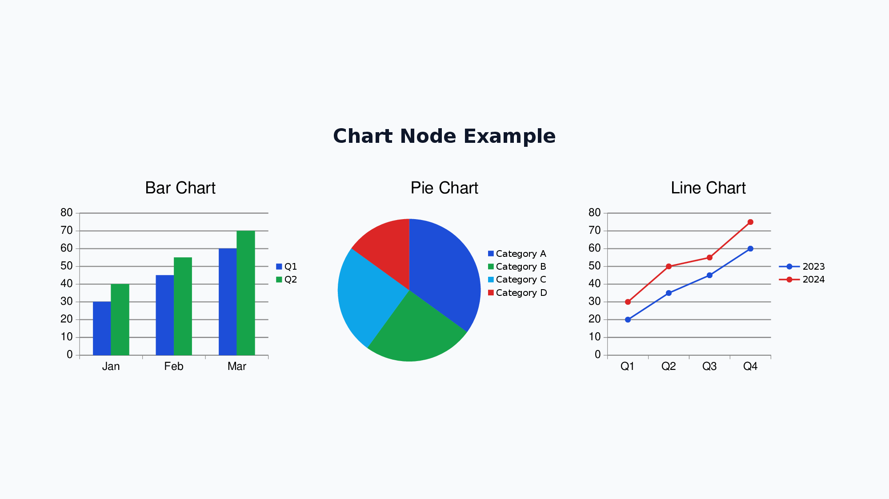
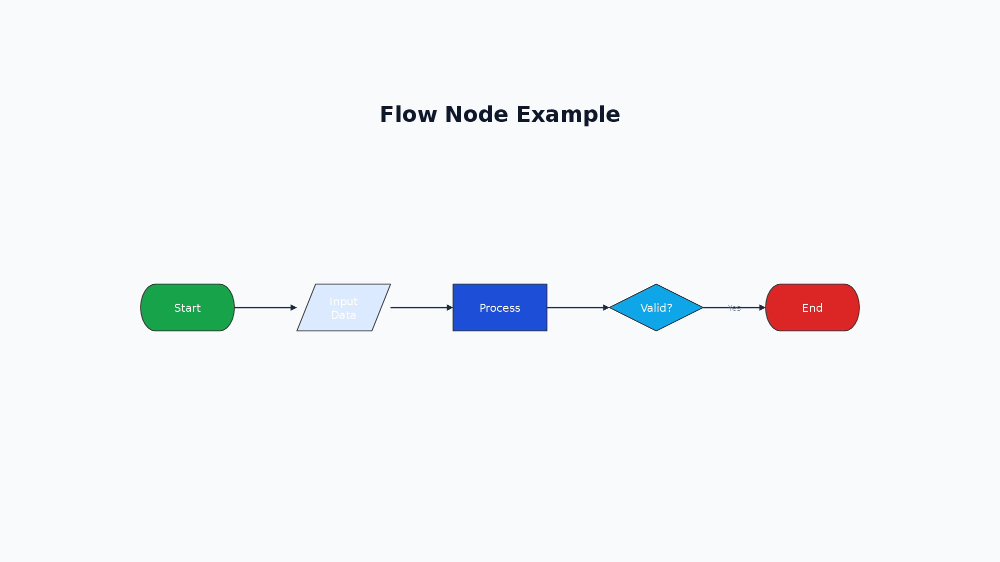
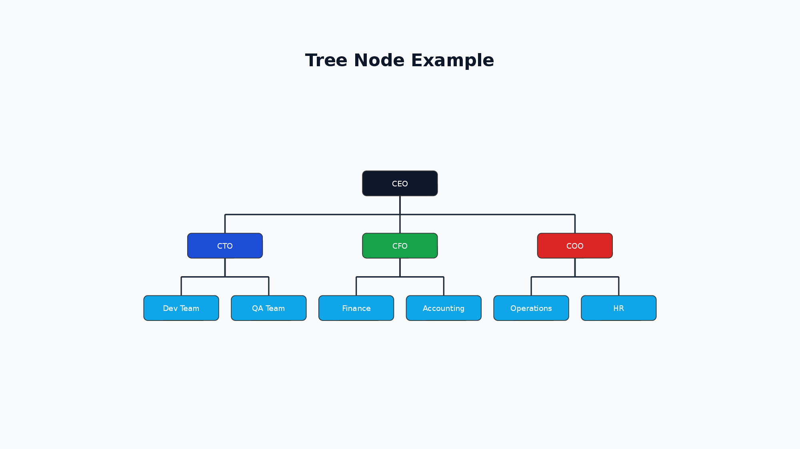
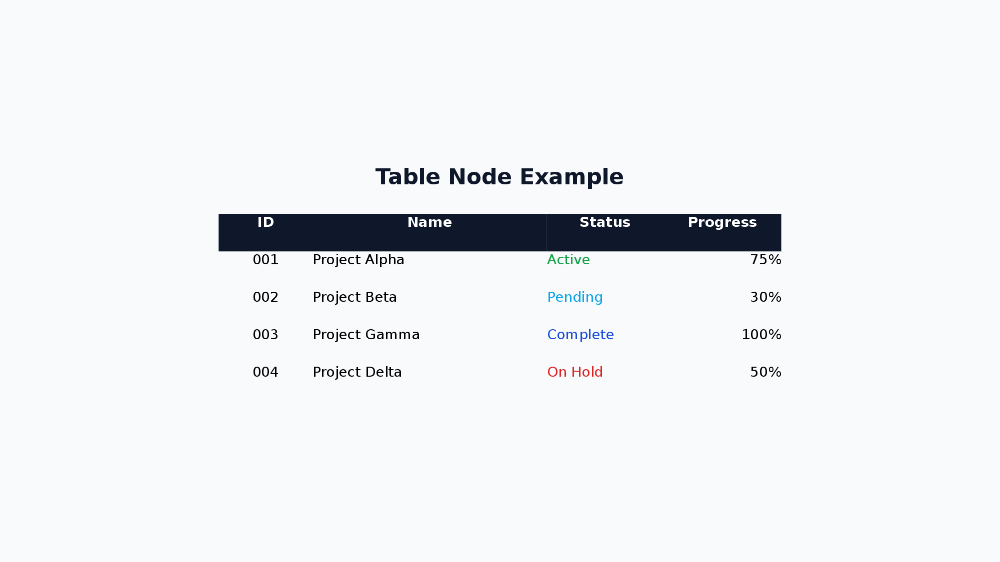
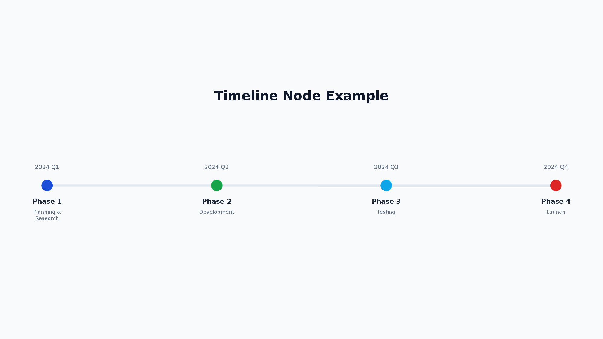
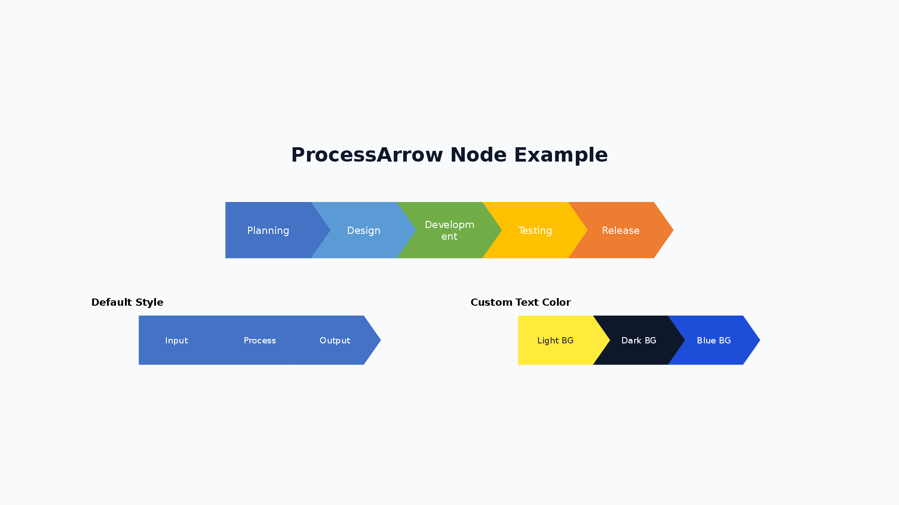
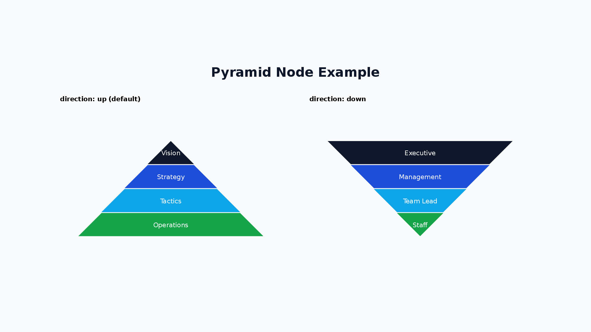

<h1 align="center">pom</h1>
<p align="center">
  AI-friendly PowerPoint generation with a Flexbox layout engine.
</p>

<p align="center">
  <a href="https://www.npmjs.com/package/@hirokisakabe/pom"></a>
  <a href="https://github.com/hirokisakabe/pom/blob/main/LICENSE"></a>
</p>

<p align="center">
  <b>pom (PowerPoint Object Model)</b> is a TypeScript library that converts XML into editable PowerPoint files (.pptx).
</p>

<p align="center">
  <a href="https://pom.pptx.app/playground"><b>Try it online — Playground</b></a>
</p>

<p align="center">
  <a href="https://pom.pptx.app/playground">
    
  </a>
</p>

---

## Table of Contents

- [Features](#features)
- [Installation](#installation)
- [Quick Start](#quick-start)
- [Available Nodes](#available-nodes)
- [Node Examples](#node-examples)
- [Documentation](#documentation)
- [License](#license)

## Features

- **AI Friendly** — Simple XML structure designed for LLM code generation. Include [llm.txt](./website/public/llm.txt) in your system prompt for XML reference. Also available at `https://pom.pptx.app/llm.txt`.
- **Declarative** — Describe slides as XML. No imperative API calls needed — just data in, PPTX out.
- **Flexible Layout** — Flexbox-style layout with VStack / HStack, powered by yoga-layout. Ratio-based layouts (e.g., 2:1 columns) via the `grow` attribute (CSS `flex-grow`).
- **Shorthand + Dot Notation** — Layout/style attributes (e.g. `padding`, `margin`, `border`, `fill`, `shadow`) can mix shorthand and dot notation on the same node. Shorthand sets defaults and dot notation overrides specific keys.
- **Per-Side Borders** — `borderTop` / `borderRight` / `borderBottom` / `borderLeft` style each edge independently (e.g. `borderLeft.width="6"` for an accent bar, `borderBottom.width="3"` for an underlined heading), merging field-by-field with the uniform `border`. See [Nodes — Common Properties](./docs/nodes.md#common-properties).
- **Rich Nodes** — 20 built-in node types: charts, flowcharts, tables, timelines, org trees, and more.
- **Design Tokens** — Declare a color palette once with a top-level `<Theme>` element and reference tokens as `$name` from any color attribute. See [Nodes — Top-Level `<Theme>`](./docs/nodes.md#top-level-theme-design-tokens).
- **Schema-validated** — XML input is validated with Zod schemas at runtime with clear error messages.
- **PowerPoint Native** — Generates real editable PowerPoint shapes — not images. Recipients can modify everything. Linear gradient backgrounds (`backgroundGradient="linear-gradient(135deg, #667EEA 0%, #764BA2 100%)"`) and text fills (`textGradient="linear-gradient(90deg, #38BDF8 0%, #A78BFA 100%)"` on `<Text>`) are exported as native gradient fills.
- **Leaf Rotation** — `Text`, `Shape`, `Image`, and `Icon` support `rotate` in clockwise degrees at render time without affecting flex layout.
- **Pixel Units** — Intuitive pixel-based sizing (internally converted to inches at 96 DPI).
- **Master Slide** — Define headers, footers, and page numbers once — applied to all slides automatically.
- **Accurate Text Measurement** — Text width measured with opentype.js and bundled Noto Sans JP fonts for consistent layout.

## Installation

> Requires Node.js 18+

```bash
npm install @hirokisakabe/pom
```

## Quick Start

```typescript
import { buildPptx } from "@hirokisakabe/pom";

const xml = `
<Slide>
  <VStack w="100%" h="max" padding="48" gap="24" alignItems="start">
    <Text fontSize="48" bold="true">Presentation Title</Text>
    <Text fontSize="24" color="666666">Subtitle</Text>
  </VStack>
</Slide>
`;

const { pptx } = await buildPptx(xml, { w: 1280, h: 720 });
await pptx.writeFile({ fileName: "presentation.pptx" });
```

Each slide must be wrapped in a `<Slide>` element. To produce multiple slides, list multiple `<Slide>` elements at the top level. A single top-level `<Theme>` element may precede the slides to declare color tokens (referenced as `$name` from color attributes):

```xml
<Theme surface="0F172A" accent="38BDF8" textMain="F8FAFC" />
<Slide>
  <VStack w="100%" h="max" padding="48" backgroundColor="$surface">
    <Text fontSize="48" bold="true" color="$textMain">Dark Theme</Text>
  </VStack>
</Slide>
```

## Available Nodes

| Node         | Description                                                                                                                                                                                                |
| ------------ | ---------------------------------------------------------------------------------------------------------------------------------------------------------------------------------------------------------- |
| Text         | Text with font styling, decoration (incl. subscript / superscript), rotation, letter spacing, glow / outline effects, inline bold/italic/underline/strike/sub/sup/highlight/color/fontSize, and hyperlinks |
| Ul           | Unordered (bullet) list with Li items                                                                                                                                                                      |
| Ol           | Ordered (numbered) list with Li items                                                                                                                                                                      |
| Image        | Images from file path, URL, or base64, with optional rotation                                                                                                                                              |
| Table        | Tables with customizable columns and rows                                                                                                                                                                  |
| Shape        | PowerPoint shapes (roundRect, ellipse, etc.) with optional rotation, native glow, and outline effects                                                                                                      |
| Chart        | Charts (bar, line, pie, area, doughnut, radar)                                                                                                                                                             |
| Timeline     | Timeline / roadmap visualizations                                                                                                                                                                          |
| Matrix       | 2x2 positioning maps                                                                                                                                                                                       |
| Tree         | Organization charts and decision trees                                                                                                                                                                     |
| Flow         | Flowcharts with nodes and edges                                                                                                                                                                            |
| ProcessArrow | Chevron-style process diagrams                                                                                                                                                                             |
| Pyramid      | Pyramid diagrams for hierarchies                                                                                                                                                                           |
| Line         | Horizontal / vertical lines                                                                                                                                                                                |
| Arrow        | Connectors between nodes referenced by ID                                                                                                                                                                  |
| Layer        | Absolute-positioned overlay container                                                                                                                                                                      |
| VStack       | Vertical stack layout                                                                                                                                                                                      |
| HStack       | Horizontal stack layout                                                                                                                                                                                    |
| Icon         | Lucide icons with optional rotation; variant background supports native glow / outline effects                                                                                                             |
| Svg          | Inline SVG graphics                                                                                                                                                                                        |

For detailed node documentation, see [Nodes](./docs/nodes.md).

## Node Examples

### Chart

```xml
<Chart chartType="bar" w="350" h="250" showTitle="true" title="Bar Chart" showLegend="true">
  <ChartSeries name="Q1">
    <ChartDataPoint label="Jan" value="30" />
    <ChartDataPoint label="Feb" value="45" />
  </ChartSeries>
</Chart>

<!-- Sparkline mode: hides legend / axes / margins for compact h=40 inline charts (bar / line / area) -->
<Chart chartType="bar" w="200" h="40" sparkline="true" chartColors='["0088CC"]'>
  <ChartSeries name="Sales">
    <ChartDataPoint label="Q1" value="100" />
    <ChartDataPoint label="Q2" value="200" />
    <ChartDataPoint label="Q3" value="150" />
    <ChartDataPoint label="Q4" value="300" />
  </ChartSeries>
</Chart>
```



### Flow

```xml
<Flow direction="horizontal" w="100%" h="300">
  <FlowNode id="start" shape="flowChartTerminator" text="Start" color="16A34A" />
  <FlowNode id="process" shape="flowChartProcess" text="Process" color="1D4ED8" />
  <FlowNode id="end" shape="flowChartTerminator" text="End" color="DC2626" />
  <FlowConnection from="start" to="process" />
  <FlowConnection from="process" to="end" />
</Flow>
```



### Tree

```xml
<Tree layout="vertical" nodeShape="roundRect" w="100%" h="400">
  <TreeItem label="CEO" color="0F172A">
    <TreeItem label="CTO" color="1D4ED8">
      <TreeItem label="Dev Team" color="0EA5E9" />
    </TreeItem>
    <TreeItem label="CFO" color="16A34A">
      <TreeItem label="Finance" color="0EA5E9" />
    </TreeItem>
  </TreeItem>
</Tree>
```



### Table

```xml
<Table defaultRowHeight="36" cellBorder='{"color":"CBD5E1","width":1}'>
  <Col width="80" />
  <Col width="200" />
  <Tr>
    <Td bold="true" backgroundColor="0F172A" color="FFFFFF">ID</Td>
    <Td bold="true" backgroundColor="0F172A" color="FFFFFF">Name</Td>
  </Tr>
  <Tr>
    <Td>001</Td>
    <Td>Project Alpha</Td>
  </Tr>
</Table>
```



### Timeline

```xml
<Timeline direction="horizontal" w="100%" h="200">
  <TimelineItem date="2024 Q1" title="Phase 1" description="Planning" color="1D4ED8" />
  <TimelineItem date="2024 Q2" title="Phase 2" description="Development" color="16A34A" />
  <TimelineItem date="2024 Q3" title="Phase 3" description="Testing" color="0EA5E9" />
</Timeline>
```

`connectorColor` / `connectorGradient` customize the axis line. `useColorForDate` makes each item's date inherit its `color`, and `TimelineItem.dateColor` overrides per item. `fontFamily` swaps the default `Noto Sans JP` for any other family.

```xml
<Timeline direction="horizontal" w="100%" h="120"
          connectorGradient="linear-gradient(90deg, #1D4ED8 0%, #DC2626 100%)"
          useColorForDate="true" fontFamily="Arial">
  <TimelineItem date="Start" title="Begin" color="1D4ED8" />
  <TimelineItem date="Mid" title="Middle" color="9333EA" dateColor="111827" />
  <TimelineItem date="End" title="Finish" color="DC2626" />
</Timeline>
```



### ProcessArrow

```xml
<ProcessArrow direction="horizontal" w="100%" h="100">
  <ProcessArrowStep label="Planning" color="4472C4" />
  <ProcessArrowStep label="Design" color="5B9BD5" />
  <ProcessArrowStep label="Development" color="70AD47" />
  <ProcessArrowStep label="Testing" color="FFC000" />
  <ProcessArrowStep label="Release" color="ED7D31" />
</ProcessArrow>
```



### Pyramid

```xml
<Pyramid direction="up" w="600" h="300">
  <PyramidLevel label="Strategy" color="E91E63" />
  <PyramidLevel label="Tactics" color="9C27B0" />
  <PyramidLevel label="Execution" color="673AB7" />
</Pyramid>
```



## Auto-Fit

When content exceeds the slide height, pom automatically adjusts it to fit within the slide. This is enabled by default.

Adjustments are applied in the following priority order:

1. Reduce table row heights
2. Reduce text font sizes
3. Reduce gap / padding
4. Uniform scaling (fallback)

To disable:

```typescript
const { pptx } = await buildPptx(xml, { w: 1280, h: 720 }, { autoFit: false });
```

## Documentation

| Document                                       | Description                           |
| ---------------------------------------------- | ------------------------------------- |
| [API Reference](./docs/api-reference.md)       | `buildPptx()` function and options    |
| [Nodes](./docs/nodes.md)                       | Complete reference for all node types |
| [Master Slide](./docs/master-slide.md)         | Headers, footers, and page numbers    |
| [Text Measurement](./docs/text-measurement.md) | Text measurement options and settings |
| [llm.txt](./website/public/llm.txt)            | Compact XML reference for LLM prompts |
| [Playground](https://pom.pptx.app/playground)  | Try pom XML in the browser            |

## License

MIT
