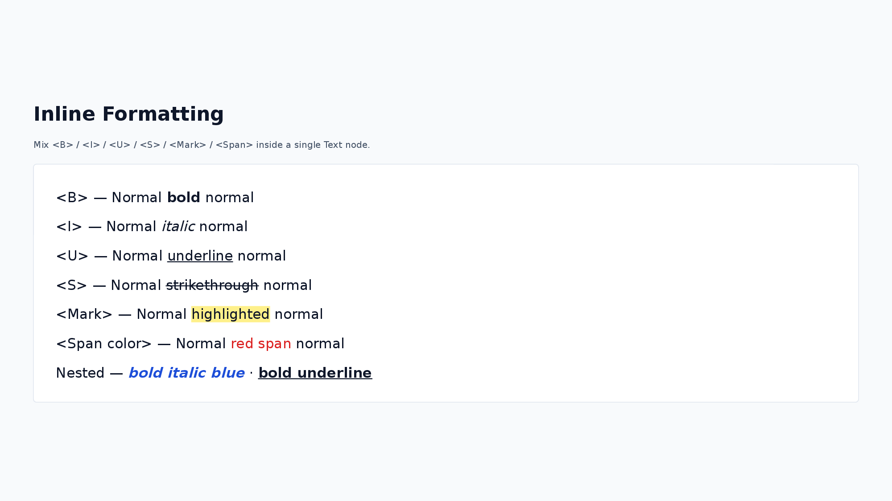
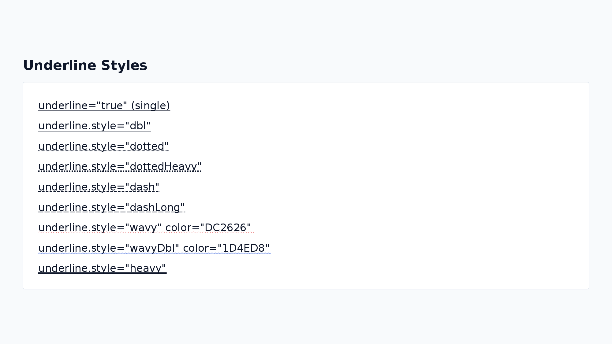
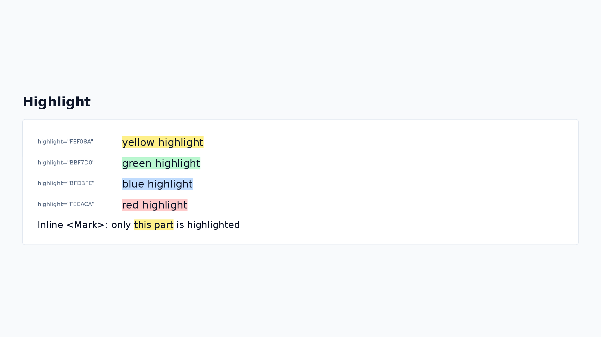
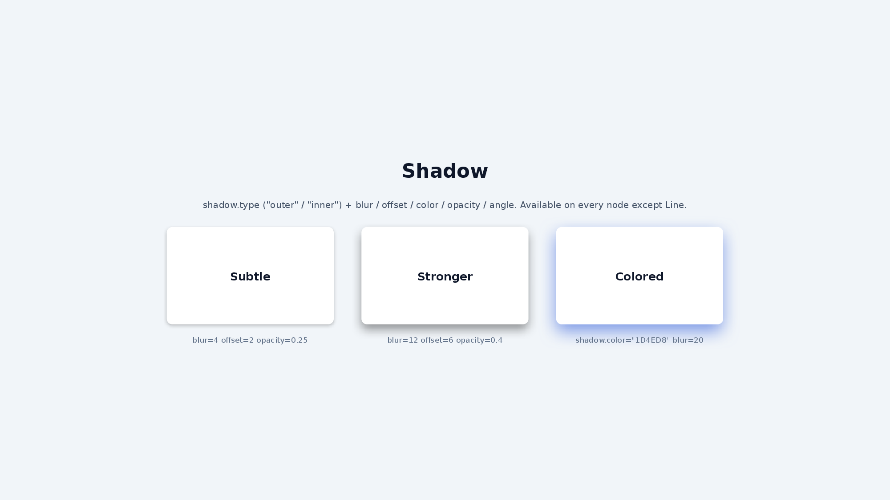
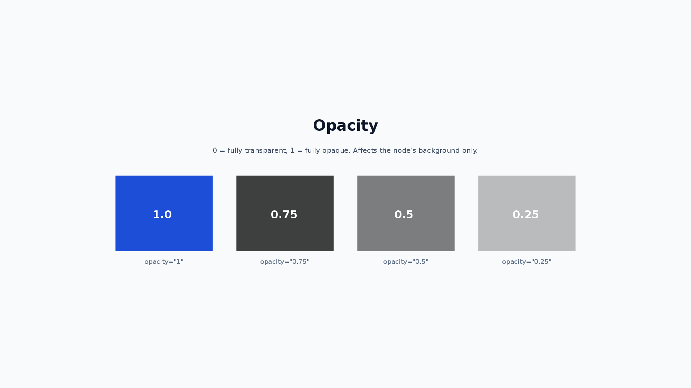
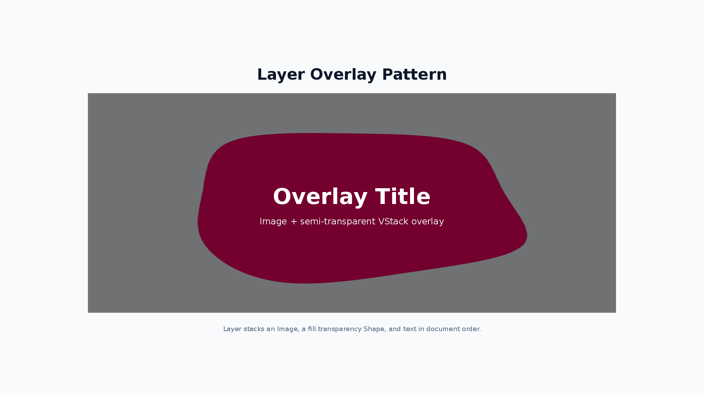
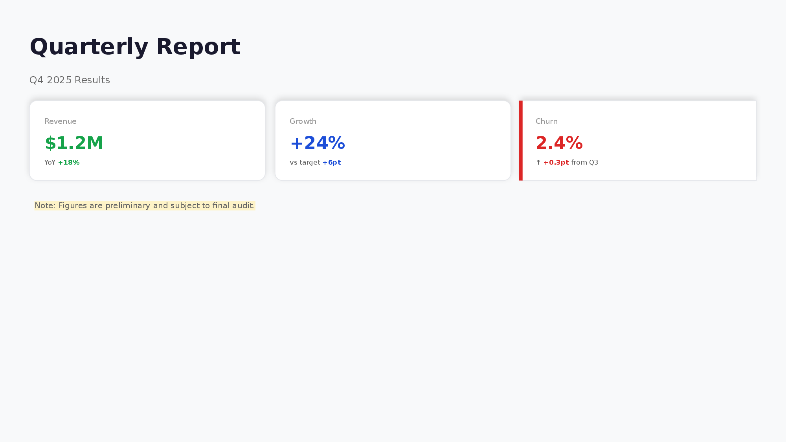

# Styling Guide

A practical guide to styling pom presentations — colors, fonts, backgrounds, borders, shadows, and more.

## Color Format

Colors are specified as **6-digit hex without the `#` prefix** (e.g., `FF0000`, `333333`). This is the recommended format for consistency.

```xml
<Text color="333333">Dark gray text</Text>
<Text color="FF0000">Red text</Text>
<VStack backgroundColor="F8F9FA"><Text>Light gray background</Text></VStack>
```

### Design Tokens with `<Theme>`

Declare a color palette once at the top level with a `<Theme>` element and reference each token from any color attribute as `$tokenName`. This keeps the palette in one place instead of repeating hex values on every node.


```xml
<Theme surface="0F172A" accent="38BDF8" textMain="F8FAFC" textMuted="94A3B8" />
<Slide>
  <VStack w="100%" h="max" padding="48" gap="16" backgroundColor="$surface">
    <Text fontSize="28" color="$textMain" bold="true">Title</Text>
    <Timeline dateColor="$textMuted" titleColor="$textMain" w="1000" h="120">
      <TimelineItem date="Q1" title="Phase 1" color="$accent" />
    </Timeline>
  </VStack>
</Slide>
```

- At most one `<Theme>` per document; it applies to all slides regardless of position.
- `$tokenName` references are resolved in color attributes (any attribute ending in `Color` / `Colors`, `color` keys inside object/JSON attributes, `highlight`) and inside `backgroundGradient` strings.
- Composite nodes (`Timeline`, `Matrix`, `Tree`, `Flow`) expose dedicated text-color attributes (e.g. `dateColor` / `titleColor` / `axisLabelColor` / `textColor` / `connectorStyle.labelColor`) so the whole deck — including labels on charts and diagrams — can be retinted from a single `<Theme>`.
- Token names start with a letter and may contain letters, digits, `_`, and `-`. Values are 6-digit hex (`#` prefix optional). Referencing an unknown token throws a `ParseXmlError` with a "did you mean" suggestion.

See [Nodes — Top-Level `<Theme>`](./nodes.md#top-level-theme-design-tokens) for the full reference.

### Recommended Color Palette

A set of colors that work well for business presentations:

| Purpose    | Color       | Hex      |
| ---------- | ----------- | -------- |
| Title      | Near-black  | `1A1A2E` |
| Body text  | Dark gray   | `333333` |
| Subtitle   | Medium gray | `666666` |
| Muted text | Light gray  | `999999` |
| Primary    | Blue        | `1D4ED8` |
| Success    | Green       | `16A34A` |
| Warning    | Amber       | `D97706` |
| Danger     | Red         | `DC2626` |
| Info       | Sky blue    | `0EA5E9` |
| Light BG   | Off-white   | `F8F9FA` |
| Border     | Light gray  | `E5E7EB` |

## Font

The default font is **Noto Sans JP**, bundled with pom for accurate text measurement in both Node.js and browser environments.

### Specifying a Font

```xml
<Text fontFamily="Arial">English text in Arial</Text>
<Text fontFamily="Noto Sans JP">Japanese text (default)</Text>
```

> **Note:** Custom fonts must be installed on the system where the PPTX is opened. Noto Sans JP is the only font with built-in measurement support.

### Font Size Guide

| Role    | Size (px) | Usage                       |
| ------- | --------- | --------------------------- |
| Title   | 28–40     | Slide titles                |
| Heading | 18–24     | Section headings            |
| Body    | 13–16     | Paragraphs and list items   |
| Caption | 10–12     | Footnotes, labels, captions |

```xml
<VStack gap="12" alignItems="start">
  <Text fontSize="36" bold="true" color="1A1A2E">Slide Title</Text>
  <Text fontSize="20" bold="true" color="333333">Section Heading</Text>
  <Text fontSize="14" color="333333">Body text with regular size.</Text>
  <Text fontSize="11" color="999999">Caption or footnote</Text>
</VStack>
```

### Line Height

Control line spacing with `lineHeight` (multiplier of `fontSize`, default: `1.3`).

```xml
<Text lineHeight="1.5">Wider line spacing for readability</Text>
<Text lineHeight="1.0">Tight line spacing</Text>
```

For `Text` (and the text inside `Shape`), `lineHeight` is reflected in both the yoga layout measurement (block height = lines × `fontSize` × `lineHeight`) and the rendered line spacing, which is emitted as a fixed value (PowerPoint `spcPts`) of `fontSize × lineHeight`. This keeps the measured height and the rendered line height aligned, so a tall `lineHeight` no longer creates asymmetric whitespace above/below the glyph ink.

`Ul` / `Ol` use a different convention. Their line spacing is rendered as a multiplier (PowerPoint `spcPct`) of the bundled-font metric, so the effective row height is `measureFontLineHeightRatio × lineHeight × fontSize`. Use the same `lineHeight` value when you want `Text` and `Ul` blocks to look visually consistent; the absolute pixel values may differ slightly.

## Text Decoration

### Bold, Italic, Strikethrough

```xml
<Text bold="true">Bold text</Text>
<Text italic="true">Italic text</Text>
<Text strike="true">Strikethrough text</Text>
<Text bold="true" italic="true">Bold italic</Text>
```

### Inline Formatting

Use `<B>`, `<I>`, `<U>`, `<S>`, `<Mark>`, and `<Span>` child elements to apply bold, italic, underline, strikethrough, highlight, color, or per-run `fontSize` to part of the text:



```xml
<Text fontSize="16">Normal <B>bold part</B> normal</Text>
<Text fontSize="16">Normal <I>italic part</I> normal</Text>
<Text fontSize="16"><B>bold</B> and <I>italic</I> mixed</Text>
<Text fontSize="16"><B><I>Bold italic (nested)</I></B></Text>
<Text fontSize="16">Normal <U>underline part</U> normal</Text>
<Text fontSize="16">Normal <S>strikethrough part</S> normal</Text>
<Text fontSize="16"><Mark color="FFFF00">highlighted part</Mark> normal</Text>
<Text fontSize="16"><B><U>Bold underline (nested)</U></B></Text>
<Text fontSize="16">Normal <Span color="FF0000">red part</Span> normal</Text>
<Text fontSize="16"><B><Span color="1D4ED8">bold blue</Span></B></Text>
<Text fontSize="52" bold="true" color="1D4ED8">¥84.2<Span fontSize="20">M</Span></Text>
```

`<Span fontSize>` is handy for KPI-style "big number + small unit" composition (`¥84.2M`, `118%`) within a single `<Text>` — the digit and unit share one baseline automatically without needing the older `HStack` + `alignItems="end"` workaround. Layout measurement uses the largest run-level `fontSize` so the Text container is sized for the biggest glyph.

This also works inside `<Li>` and `<Td>`:

```xml
<Ul fontSize="14">
  <Li>Normal <B>bold</B> item</Li>
  <Li>Normal <U>underline</U> item</Li>
</Ul>
```

### Underline



Simple underline:

```xml
<Text underline="true">Underlined text</Text>
```

Customized underline with style and color:

```xml
<Text underline.style="wavy" underline.color="FF0000">Wavy red underline</Text>
<Text underline.style="dbl">Double underline</Text>
<Text underline.style="dotted">Dotted underline</Text>
```

See the Text section in [Nodes](./nodes.md) for all available underline styles.

### Highlight

Apply a background highlight to text:



```xml
<Text highlight="FFFF00">Yellow highlighted text</Text>
<Text highlight="90EE90">Green highlighted text</Text>
```

### Text Effects (glow / outline)

`glow` adds a glow halo around the characters; `outline` draws a border along the character edges. Both are exported as native PowerPoint text effects (editable, not rasterized) and are useful for keeping titles legible on top of background images.


```xml
<Text fontSize="40" bold="true" color="FFFFFF" glow.size="8" glow.opacity="0.5" glow.color="1D4ED8">Glowing title</Text>
<Text fontSize="40" bold="true" color="FFFFFF" outline.size="2" outline.color="0F172A">Outlined title</Text>
```

| Property        | Type   | Description                        |
| --------------- | ------ | ---------------------------------- |
| `glow.size`     | number | Glow radius in px (default: `8`)   |
| `glow.opacity`  | 0–1    | Glow opacity (default: `0.75`)     |
| `glow.color`    | hex    | Glow color (default: `FFFFFF`)     |
| `outline.size`  | number | Outline width in px (default: `1`) |
| `outline.color` | hex    | Outline color (default: `FFFFFF`)  |

- Both apply per text node. When inline formatting (`<B>`, `<Span>`, ...) is used, the node-level effect applies to all runs.
- LibreOffice does not render character glow (outline renders fine); open the PPTX in PowerPoint to see the glow.

### Text Alignment

```xml
<Text textAlign="left">Left aligned (default)</Text>
<Text textAlign="center">Center aligned</Text>
<Text textAlign="right">Right aligned</Text>
```

## Background

### Background Color

All nodes support `backgroundColor`:

```xml
<Text backgroundColor="F8F9FA" padding="16">Content on a light gray background</Text>
```

### Background Gradient

Apply a CSS-like `linear-gradient()` as the background with `backgroundGradient`. Exported as a native PowerPoint gradient fill (editable in PowerPoint, not rasterized). Takes precedence over `backgroundColor` and works on the slide root for full-slide gradient backgrounds.


```xml
<VStack backgroundGradient="linear-gradient(135deg, #1E40AF 0%, #0EA5E9 100%)" w="600" h="300" padding="32">
  <Text fontSize="24" color="FFFFFF" bold="true">Gradient background</Text>
</VStack>
<VStack backgroundGradient="linear-gradient(to right, #16A34A 0%, #DBEAFE 100%)" w="600" h="200" padding="32" />
<VStack backgroundGradient="linear-gradient(45deg, #7C3AED 0%, #EC4899 50%, #F97316 100%)" w="600" h="200" padding="32" />
```

The angle accepts `<n>deg` (0 = bottom-to-top, clockwise) or `to <direction>` keywords (`to right`, `to bottom left`, ...) and defaults to `180deg` (top-to-bottom). Two or more hex color stops are required; stop positions (`%`) are optional and distributed evenly when omitted.

### Background Image

Set a background image with `backgroundImage.src` and control sizing with `backgroundImage.sizing`:

```xml
<Text backgroundImage.src="./photo.jpg" backgroundImage.sizing="cover" w="400" h="300" color="FFFFFF">Text over image</Text>
```

| Property                 | Values                   | Description                                         |
| ------------------------ | ------------------------ | --------------------------------------------------- |
| `backgroundImage.src`    | URL / file path / base64 | Image source                                        |
| `backgroundImage.sizing` | `cover` / `contain`      | `cover` fills area (default), `contain` fits within |

## Border

Add borders to any node with dot notation:

```xml
<Text border.color="E5E7EB" border.width="1" padding="16">Container with a light border</Text>
```

### Border Properties

| Property          | Type   | Description            |
| ----------------- | ------ | ---------------------- |
| `border.color`    | hex    | Border color           |
| `border.width`    | number | Border width (px)      |
| `border.dashType` | string | Line style (see below) |

### Border Dash Types

See Common Properties in [Nodes](./nodes.md) for available dash types.

```xml
<Text border.color="333333" border.width="2" border.dashType="dash" padding="16">Dashed border</Text>
```

### Border Radius

Round corners with `borderRadius`:

```xml
<Text backgroundColor="1D4ED8" borderRadius="8" padding="16" color="FFFFFF">Rounded box</Text>
```

### Per-Side Border

Style each edge independently with `borderTop` / `borderRight` / `borderBottom` / `borderLeft`. Each uses the same fields as `border` (`color` / `width` / `dashType`).


```xml
<Text borderLeft.color="1D4ED8" borderLeft.width="6" padding.left="16">Accent bar</Text>
<Text borderBottom.color="333333" borderBottom.width="3">Underlined heading</Text>
```

- Per-side values merge field-by-field with the uniform `border` (per-side takes precedence) — `border.color="E5E7EB" border.width="1" borderLeft.width="6"` is a thin frame with a thick left accent.
- Per-side borders **cannot be combined with `borderRadius`**. When both are specified, the per-side values are ignored and the uniform `border` style is used, and a `PER_SIDE_BORDER_WITH_RADIUS` diagnostic is emitted at build time.

## Shadow

Add drop shadows to any node (except Line):



```xml
<VStack shadow.type="outer" shadow.blur="4" shadow.offset="2" shadow.color="000000" shadow.opacity="0.3" padding="16">
  <Text>Card with shadow</Text>
</VStack>
```

### Shadow Properties

| Property         | Type   | Description                 |
| ---------------- | ------ | --------------------------- |
| `shadow.type`    | string | `outer` (default) / `inner` |
| `shadow.blur`    | number | Blur radius                 |
| `shadow.offset`  | number | Offset distance             |
| `shadow.angle`   | number | Angle in degrees            |
| `shadow.color`   | hex    | Shadow color                |
| `shadow.opacity` | 0–1    | Shadow opacity              |

## Opacity

Control background transparency with `opacity` (0 = fully transparent, 1 = fully opaque):



```xml
<Text backgroundColor="1D4ED8" opacity="0.5" padding="16">Semi-transparent blue background</Text>
```

## Rotation

`Text`, `Shape`, `Image`, and `Icon` accept `rotate` as a number of degrees clockwise. Rotation is applied only when rendering to PowerPoint; yoga layout uses the unrotated bounding box, so the rotated node does not change sibling placement or the parent's size.


```xml
<Text rotate="12">Rotated label</Text>
<Shape shapeType="rect" w="120" h="60" rotate="-15" />
<Image src="sample.png" w="160" h="100" rotate="8" />
<Icon name="cpu" rotate="45" />
```

> Rotated nodes are intentionally excluded from the `NODE_OUT_OF_BOUNDS` diagnostic because their final bounds cannot be derived from the static layout — verify them visually.

### Overlay Pattern with Layer

Combine `opacity` with Layer for overlay effects:



```xml
<Layer w="800" h="400">
  <Image src="./photo.jpg" w="800" h="400" />
  <Shape shapeType="rect" w="800" h="400" fill.color="000000" fill.transparency="0.6" />
  <VStack w="800" h="400" justifyContent="center" alignItems="center">
    <Text fontSize="36" bold="true" color="FFFFFF">Overlay Title</Text>
  </VStack>
</Layer>
```

## Shape Fill and Line

Shape nodes use `fill` for background and `line` for outline (separate from the common `border` property):

```xml
<Shape shapeType="rect" w="200" h="100"
  fill.color="1D4ED8" fill.transparency="0"
  line.color="0F3B8E" line.width="2">
  Styled shape
</Shape>
```

### Fill Properties

| Property            | Type | Description                    |
| ------------------- | ---- | ------------------------------ |
| `fill.color`        | hex  | Fill color                     |
| `fill.transparency` | 0–1  | Fill transparency (0 = opaque) |

### Line Properties

| Property        | Type   | Description               |
| --------------- | ------ | ------------------------- |
| `line.color`    | hex    | Outline color             |
| `line.width`    | number | Outline width (px)        |
| `line.dashType` | string | Same dash types as border |

## Combining Styles

A practical example combining multiple styling techniques:



```xml
<VStack w="max" h="max" padding="48" gap="24" backgroundColor="F8F9FA">
  <!-- Title area -->
  <Text fontSize="36" bold="true" color="1A1A2E">Quarterly Report</Text>
  <Text fontSize="16" color="666666">Q4 2025 Results</Text>

  <!-- Card with shadow and border -->
  <HStack gap="16" w="max">
    <VStack backgroundColor="FFFFFF" borderRadius="8" padding="24" gap="8"
      border.color="E5E7EB" border.width="1"
      shadow.blur="4" shadow.offset="2" shadow.color="000000" shadow.opacity="0.1">
      <Text fontSize="12" color="999999">Revenue</Text>
      <Text fontSize="28" bold="true" color="16A34A">$1.2M</Text>
    </VStack>
    <VStack backgroundColor="FFFFFF" borderRadius="8" padding="24" gap="8"
      border.color="E5E7EB" border.width="1"
      shadow.blur="4" shadow.offset="2" shadow.color="000000" shadow.opacity="0.1">
      <Text fontSize="12" color="999999">Growth</Text>
      <Text fontSize="28" bold="true" color="1D4ED8">+24%</Text>
    </VStack>
  </HStack>

  <!-- Highlighted note -->
  <Text fontSize="13" color="666666" highlight="FEF3C7">
    Note: Figures are preliminary and subject to final audit.
  </Text>
</VStack>
```
